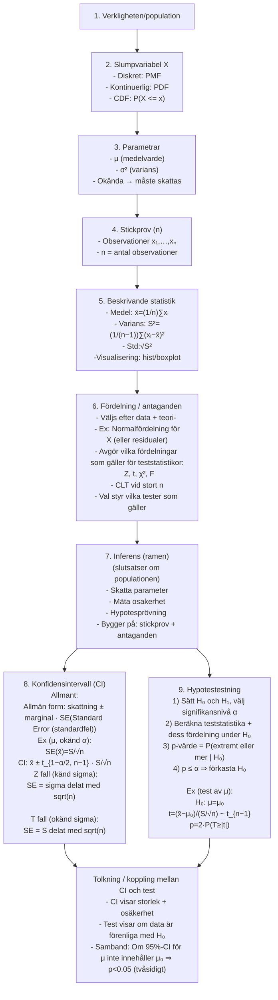

```mermaid
flowchart TD
  A["1. Verkligheten/population"] --> B

  B["2. Slumpvariabel X<br/>- Diskret: PMF<br/>- Kontinuerlig: PDF<br/>- CDF: P(X <= x)"] --> C

  C["3. Parametrar<br/>- μ (medelvarde)<br/>- σ² (varians)<br/>- Okända → måste skattas"] --> D

  D["4. Stickprov (n)<br/>- Observationer x₁,…,xₙ<br/>- n = antal observationer"] --> E

  E["5. Beskrivande statistik<br/>- Medel: x̄=(1/n)∑xᵢ<br/>- Varians: S²=(1/(n−1))∑(xᵢ−x̄)²<br/>- Std:√S²<br/>-Visualisering: hist/boxplot"] --> F

  F["6. Fördelning / antaganden<br/>- Väljs efter data + teori- <br/> - Ex: Normalfördelning för X (eller residualer)<br/>- Avgör vilka fördelningar som gäller för teststatistikor:<br/>  Z, t, χ², F<br/>- CLT vid stort n<br/>- Val styr vilka tester som gäller"] --> G

  G["7. Inferens (ramen)(slutsatser om populationen)<br/>- Skatta parameter<br/>- Mäta osakerhet<br/>- Hypotesprövning <br/>- Bygger på: stickprov + antaganden"] --> H
  G --> I

  H["8. Konfidensintervall (CI)<br/>Allmant:<br/>Allmän form: skattning ± marginal · SE(Standard Error (standardfel))<br/>Ex (μ, okänd σ):<br/>SE(x̄)=S/√n<br/>CI: x̄ ± t_{1−α/2, n−1} · S/√n<br/> Z fall (känd sigma):<br/>SE = sigma delat med sqrt(n)<br/><br/>T fall (okänd sigma):<br/>SE = S delat med sqrt(n)"] --> J

  I["9. Hypotestestning<br/>1) Sätt H₀ och H₁, välj signifikansnivå α<br/>2) Beräkna teststatistika + dess fördelning under H₀<br/>3) p-värde = P(extremt eller mer | H₀)<br/>4) p ≤ α ⇒ förkasta H₀<br/><br/>Ex (test av μ):<br/>H₀: μ=μ₀<br/>t=(x̄−μ₀)/(S/√n) ~ t_{n−1}<br/>p=2·P(T≥|t|)"] --> J

  J["Tolkning / koppling mellan CI och test<br/>- CI visar storlek + osäkerhet<br/>- Test visar om data är förenliga med H₀<br/>- Samband: Om 95%-CI för μ inte innehåller μ₀ ⇒ p<0.05 (tvåsidigt)"]

```